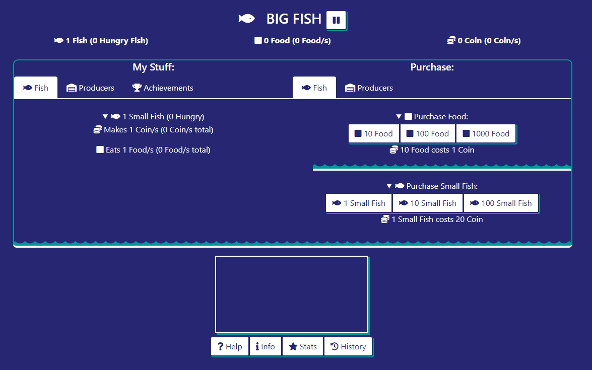
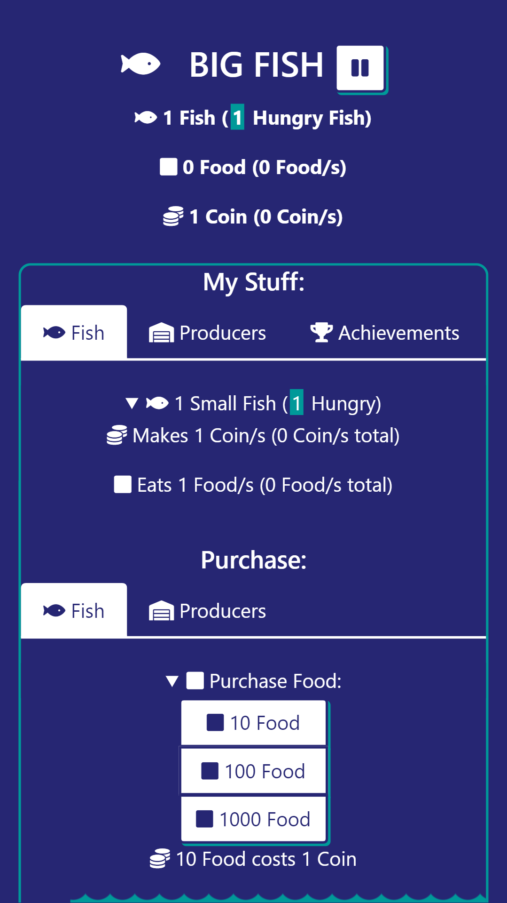

#  BIG FISH

A simple game, work your way up

https://justingolden21.github.io/big-fish/

### Gameplay

A simple cookie clicker, collect fish to earn money for you.

Manage food, aquarium space, a foodchain, and upgrades.

### Miniguide

You start with 1 fish in an aquarium.

Click to purchase 10 food for the fish.

The fish eats 1 food/s and provides 1 coin/s.

If the fish is hungry, it won't provide coins.

Your fish are immortal, and therefore won't starve.

Keep purchasing food until you have 20 coins and leftover money, then purchase another fish.

Balance out purchasing fish and food until you can afford a medium fish.

Medium fish eat 1 small fish/s cost 400, and provide 30 coin/s.

Eventually you'll work your way up to big fish.

You might run out of room in your aquarium at some point, in which case you can buy more.

You can also buy farms to automatically produce food for you, and hatcheries to produce fish for you.

Keep playing, unlock all the achievements, and get as many coins and fish as you can!

### Using

Built with [jQuery](http://jquery.com/), [Bootstrap](https://getbootstrap.com/), [Font Awesome](http://fontawesome.com), and [JS Cookie](https://github.com/js-cookie/js-cookie)

### Links

- Live demo: https://justingolden21.github.io/big-fish/

- This repo: https://github.com/justingolden21/big-fish

- My website: https://justingolden21.github.io

- My repos: https://github.com/justingolden21

- Contact me: justingolden21@gmail.com
